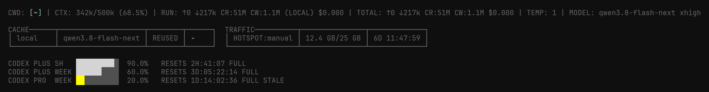

# JACK10-pi-config

My custom [`pi`](https://github.com/earendil-works/pi) harness that I've been building piece by piece.

If you are crazy enough to like what you see, feel free to copy (or portions of) it. I invite you to investigate it, or to ask an LLM what I'm doing here.

## Limitations

Don't expect to clone this and use it. It relies on [my branch of the pi](https://github.com/gojack10/pi-mono) and [my branch of tmux](https://github.com/gojack10/tmux). It also requires a plethora of gitignored stuff. And I don't read the code. It's probably low quality but it works. If you want, have an agent read the code for you.

My harness heavily depends upon [SiftText](https://sifttext.com)

# Highlights

## Riced Custom Status Bar

## Router for multiple codex accounts

The codex router reads the quota headers from every response, then ranks the accounts by room left and when the limit resets for optimal usage. A conversation stays pinned to one account so tool ids keep working, but when an account empties, the next request goes elsewhere.

## Custom subagent systemn (WIP)

Ufortunately for my personal preferences Pi's built-in subagent setup wasn't cutting it, I wanted to look at subagent chats via tmux. I started with tmux commands, then wrote custom tools `subagent-launch/` and `task-outcomes/`. They open pi in a pane, wait for it to stop cleanly, then bring the report back into the session.

## Memory and skills

I frequently work through complex problems with agents. [SiftText](https://sifttext.com) is my methodology for efficiently doing so, and my product. `sifttext-mcp/` gives pi the 28 tools that make the interface work. `sifttext-commit/` turns a finished session into commits in a tree. My skill files are mainly sifttext node pointers.

## Pi fork

Sometimes Pi can't do certain stuff, so I run [gojack10/pi-mono](https://github.com/gojack10/pi-mono). If you install upstream pi, some extensions will load and do nothing.
